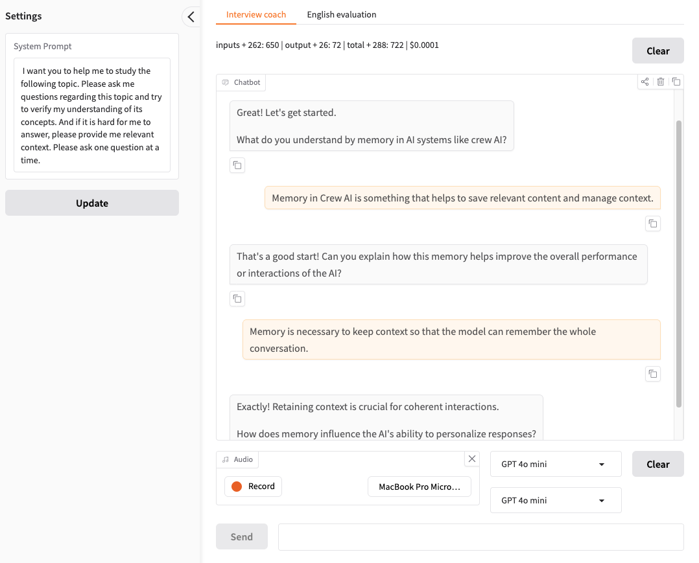
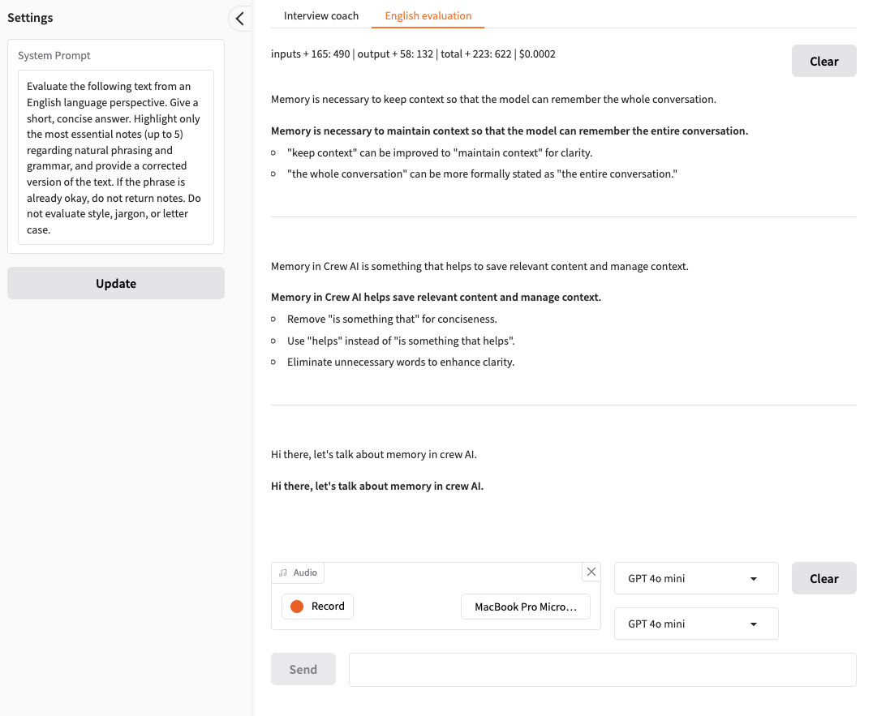

## Interview Coach

An AI-powered interview preparation tool built with Gradio that provides real-time coaching and English language evaluation.
Interview Coach is a dual-function application that helps users prepare for interviews through:
1. **Interview Coaching** - Get personalized guidance and feedback on interview responses
2. **English Evaluation** - Receive detailed analysis of your English language proficiency and speaking quality

## Features

- 🎤 **Voice Input Support** - Record audio directly through your microphone or submit text responses
- 🤖 **Multiple AI Models** - Choose between different LLMs for coaching and evaluation (GPT-5, GPT-4o, Llama 3.2, etc.)
- 💬 **Interactive Chat Interface** - Real-time conversation with your AI interview coach
- 📊 **Usage Tracking** - Monitor token usage and API costs for both coaching and evaluation functions
- ⚙️ **Customizable Prompts** - Update system prompts for different coaching and evaluation strategies
- 🔄 **Streaming Responses** - Real-time streaming of coach responses for immediate feedback

